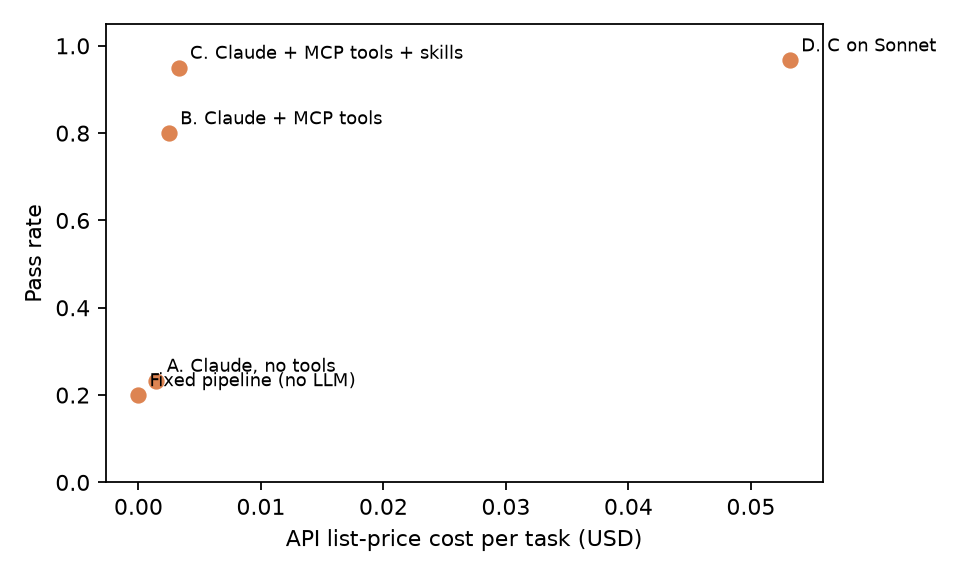

# Agent Config Bench

Controlled experiments on what makes a healthcare-evidence agent reliable: **tool access, reusable skills, and model choice**. The agent under test is [evidence-mcp-agent](https://github.com/Akhilesh-Vangala/evidence-mcp-agent), a Claude Code agent with an MCP server over live openFDA, ClinicalTrials.gov, and CMS data. Each configuration changes one thing and runs on the same 30 golden tasks with the same programmatic grader.

## Design

| Config | Model | MCP tools | Agent skills | Runs |
|---|---|---|---|---|
| Baseline | none (fixed pipeline) | its own hard-coded calls | none | 30 |
| A | Claude Haiku | no | no | 60 (30 tasks x 2) |
| B | Claude Haiku | yes | no | 60 |
| C | Claude Haiku | yes | yes | 60 |
| D | Claude Sonnet | yes | yes | 30 |

**Total: 240 runs (210 agent runs + 30 baseline).** A task passes only if every check declared for it holds: the right product's label, required sections cited, correct status (answered, refused, not found), correct human-review flag, at least N claims whose quotes appear verbatim in sources the agent retrieved, and no NCT ID that the tools never returned.

Statistics: pass rate per task averaged over repeats; 95% CIs by bootstrap over tasks (4,000 resamples); configuration differences are **paired by task**.

## Results

| Config | Pass rate (95% CI) | Claims verified | Invented trial IDs | Repeat consistency | MCP calls / task | Cost / task* | Median latency |
|---|---|---|---|---|---|---|---|
| Baseline | 20% (7 to 37%) | n/a | 0 runs | n/a | n/a | $0 | 0.1 s |
| A. no tools | 23% (10 to 40%) | 0% | 4 runs | 100% | 0 | $0.0014 | 10.3 s |
| B. tools | 80% (63 to 93%) | 89% | 0 | 100% | 3.8 | $0.0025 | 11.1 s |
| **C. tools + skills** | **95% (87 to 100%)** | **94%** | **0** | **97%** | **2.6** | **$0.0033** | **14.2 s** |
| D. C on Sonnet | 97% (90 to 100%) | 94% | 0 | n/a (1 run) | 2.1 | $0.0532 | 16.2 s |

\* API list price from measured token usage (runs used a Claude subscription through headless Claude Code).


### Paired effects (same tasks, 95% CI)

| Change | Pass-rate change | Tasks improved | Tasks regressed |
|---|---|---|---|
| Baseline to C | **+75 pts** (+60 to +90) | 23 | 0 |
| A to B (add tools) | **+57 pts** (+33 to +77) | 19 | 2 (R02, R03) |
| B to C (add skills) | **+15 pts** (+2 to +30) | 5 (A02, L05, R02, R03, T02) | 1 (L11) |
| C to D (Haiku to Sonnet) | +2 pts (0 to +5) | 1 | 0 |

### Pass rate by task category

| Category | Baseline | A | B | C | D |
|---|---|---|---|---|---|
| Label questions (12) | 0% | 8% | 83% | 88% | 92% |
| Ambiguous product names (3) | 33% | 0% | 67% | 100% | 100% |
| Comparisons (3) | 0% | 33% | 100% | 100% | 100% |
| Clinical trials (4) | 100% | 0% | 75% | 100% | 100% |
| Medicare coverage (3) | 33% | 33% | 100% | 100% | 100% |
| Refusals (2) | 0% | 100% | 50% | 100% | 100% |
| Off-label (1) | 0% | 100% | 0% | 100% | 100% |
| Not found (2) | 0% | 50% | 100% | 100% | 100% |

## Findings

1. **Tools are what make the agent grounded.** Without tools, Claude produced 210 claims and none could be traced to a retrieved source; 4 runs named NCT IDs that do not exist. With MCP tools, no configuration invented a trial ID.
2. **Tools alone make the agent less careful.** Going from A to B, refusal and off-label handling *dropped* (R02, R03 regressed): once the model has data to work with, it tries to answer requests it should decline.
3. **Skills restore judgment and sharpen tool use.** The `review-escalation` skill fixed every refusal and off-label case; `fda-label-lookup` fixed product collisions (KEYTRUDA vs KEYTRUDA QLEX, Lunsumio vs Lunsumio Velo). Skills also raised claim verification from 89% to 94% and cut MCP calls per task from 3.8 to 2.6, while adding about 3 s of latency to load them.
4. **A bigger model is not the lever here.** Sonnet added 2 points over Haiku at 16x the cost per task. For this workflow, spend on instructions, skills, and tools before model size.
5. **What is left is over-escalation, the safe failure.** In C, every failed check was a human-review flag raised when the task did not require one. No run passed an unverifiable claim, cited the wrong product, or missed a refusal.

### Failure taxonomy (checks that failed, all runs)

| Config | Failed checks |
|---|---|
| Baseline | wrong product 18, required section missing 8, status 4, review flag 2, ... |
| A | too few verified claims 44, required section 30, review flag 22, min trials 8, invented NCT IDs 4 |
| B | review flag 6, wrong product 2, too few verified claims 2, min trials 2, status 2 |
| C | review flag 3 |
| D | review flag 1 |

Claim-level failures in C: quote not found verbatim in the cited source (10), quote too short to verify (4), unknown source_id (1).



## Reproduce

Runs are produced by the agent repo; this repo analyzes them.

```bash
# in evidence-mcp-agent
cmg-eval-agent --configs BASELINE --workers 6
cmg-eval-agent --configs A_closed_book B_tools_only C_tools_skills --repeats 2 --workers 6
cmg-eval-agent --configs D_tools_skills_sonnet --workers 5

# here
pip install -e .
agent-config-bench path/to/reports/eval-*.json     # writes results/ and reports/
```

The exact eval outputs analyzed above (every run, every check) are in [`results/raw/`](results/raw/); computed metrics are in [`results/summary.json`](results/summary.json) and [`results/paired.json`](results/paired.json).

## Limitations

- 30 tasks and 2 repeats per configuration; the CIs are wide and small differences (C vs D) are not significant.
- Tasks were written by the author; a held-out task set and more repeats are the next steps.
- One tool change (paging long label sections) was made after a first run of C on the same tasks; the first run scored 90% and its failures were over-escalation caused by truncated sections.
- An open-weight configuration (Qwen 2.5 7B through Ollama with the same tools and skills, `ollama_runner.py` in the agent repo) is implemented but not yet evaluated at scale.
